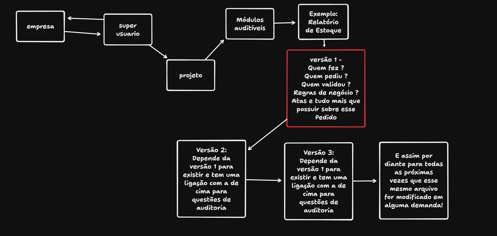

# 🚀 Sistema para Auditoria de Projetos

## 📋 Sobre o Projeto

Este Sistema será criado para auditar modificações feitas em um determinado projeto.

## ✨ Funcionalidades Principais

- 📦 **O que temos aqui?**

  - Criar um novo módulo ?
  - Auditar o módulo ?
  - Criar um novo usuário ?

## 📦 Regras de negócio?

## 🔧 Tecnologias Utilizadas

- Frontend: Vue.js 3
- Backend: Nest.js
- Banco de Dados: MySQL
- Containerização: Docker
- ORM: Prisma

## 📥 Instalação

importante: para rodar o projeto é necessário ter também o backend rodando.

1. Clone o repositório
2. Instale as dependências
3. Rode o projeto
